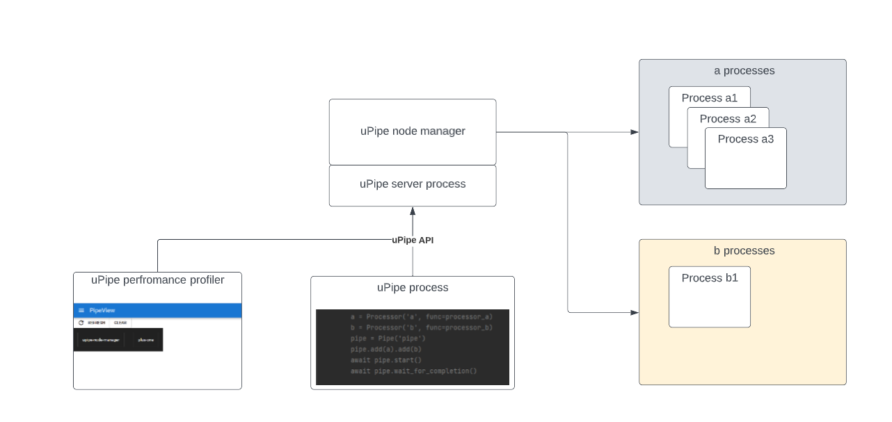
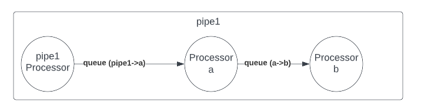
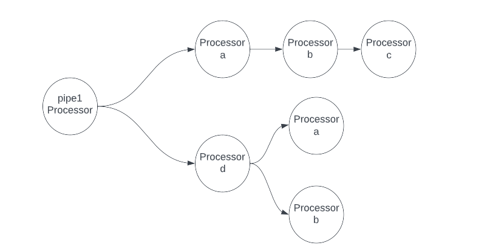
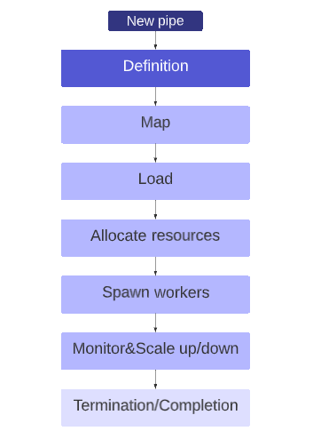

# uPipe Architecture #

Let us take a look on a simple pipeline code :
```python
        ####Declaration     
        a = Processor('a', func=processor_a)
        b = Processor('b', func=processor_b)
        pipe = Pipe('pipe')
        pipe.add(a).add(b)
        await pipe.start()
        await pipe.wait_for_completion()
```
we will use this code as a guide through our architectural walk-through.
The OS process which runs this python program is the _pipe process_.
The pipe process does not do any data processing, its is use for:
* Defining the processing tree and data flow 
* Define configuration
* Set hardware resources limits and allocation 
* Control the pipeline execution (start, stop) 
* Single point of monitoring all processes
* Manage the pipe life-cycle (load, terminate)
* Simple, code driven access to uPipe server 

here is a view of the above pipe and the processes running on the system while it's running, in this example Processor _a_ running in parallel 3 workers and :


* the pipe process : This will usually the process running the user pipeline code 
* the server process is http/websocket server running locally on the machine and accesses using _localhost_. all uPipe processes communication, control and monitoring is done through the local server.
* the node manager is running in the same process of the local server, the node manager manages the machine execution and responsible for running the pipe as well as scaling and termination.
* The node manager will spawn workers as needed, at least one worker per processor. 

### Pipe definition
Pipeline code will always start with declaring the pipeline structure. The definition is a simple chaining of processors. 
The framework manages the pipeline object in the pipeline process and only upon _load_ the server will recognize the defined pipline. 
lets take a look on simple two phases pipeline
```python
        ####Declaration     
        a = Processor('a', func=processor_a)
        b = Processor('b', func=processor_b)
        pipe = Pipe('pipe1')
        pipe.add(a).add(b)
```
the above pipeline will be represented as following:

* Every add command defines a memory q between the _adding_ Processor to the _added_ Processor
* At definition time queues and workers does not exist yet
* The pipe acts as Processor which allows it to participate in the _pipe definition phase_
* add will always return the added Processor which allows the chaining. 

here is a more complex chaining topology

```python
        ####Declaration     
        a = Processor('a', func=processor_a)
        b = Processor('b', func=processor_b)
        c = Processor('c', func=processor_c)
        d = Processor('d', func=processor_d)
        
        pipe = Pipe('pipe1')
        a.add(b).add(c)
        c.add(d)
        pipe.add(a)
        d.add(a)
        d.add(b)
        pipe.add(d)
```


Notice that in this example the same Processors are participating in different phases of the pipe. uPipe architecture separated workers, which are physical entities (OS processes) to Processors which are logical entities, and while the above contains 2 instances of the Processor _a_, there will still be a single worker for all instances of _a_ 

The queues are defined as connecting between two unique Processors (denoted as src processor->dest processor): the above pipe is expected to have d->b and a-> among its memory queues. 

#### Circular Processors 
Cyclic chaining is not allowed, the following definition is **illegal**:
```python
        ####Declaration     
        a = Processor('a', func=processor_a)
        b = Processor('b', func=processor_b)
        pipe = Pipe('pipe1')
        pipe.add(a).add(b).add(a)
```
###Pipe execution phases
These are the life cycle phases of a pipeline:



* Definition : User code defines the processors, configuration and topology
* Mapping: Upon _load_, The pipe will map and id all Processors and queues
* Load: Pipe will load the mapped pipeline definition to server, server will start if not ready
* Allocate resources: The node-manager will allocate all hardware needed for the pipe 
* Spawn workers: Once all needed resources for the pipe allocated, node-manager will spawn all workers
* Monitor & Scaling: node-manager monitors used resources and launch/terminate workers for DFPS (Data frame/second) optimization 
* Termination/completion: Once pipe is done (or asked to terminate), all workers are expected to exit with code 0.

###Starting the pipeline
```python
await pipe.start()
```
The start command loads the pipeline (if not loaded already) and initiating the pipeline execution which can take few dozens of seconds. In this time the Workers are launched amd expected to _join_ the pipeline executing pool, the worker is joining using the Processor name as match and workers are tracked by their OS process id. 
The first server initiation is called a _session_ and uPipe will track all pids of a given session. in many cases you may encounter [python zombie processes](https://medium.com/naukri-engineering/creating-troubleshooting-the-zombie-process-in-python-f4d89c46a85a), these will usually happen when running in debug mode or with app crashing. 

Zombie processes are bad in general(memory and compute leakage which eventually breaks the machine) but in uPipe they will break functionality since a zombie processes still connected to its queues, corrupting the queue memory and breaking its state.  

uPipe is maintaining [Process garbage collector](https://en.wikipedia.org/wiki/Garbage_collection_(computer_science)), where a new session will kill all previous session processes. 

###Data frame execution
A worker pulls data frame from its input queues using the _get_ method. worker is not aware to the pipeline context or data flow, it is a simple get/emit operations where get pull data frame from input queues and emit put data frame on output queues. 
The pipeline allows a global completion of data frame using the following:
```python
        the_answer = await pipe.emit(42)
```
_the_answer_ is the value returned from the _last Processor_ of the pipe. this brings up two questions:
* Who is the last processor ?
* How does the pipeline receives the results ?

Each data frame carries (in its header) the pipeline execution id, an id allocated in the first frame, the frame generated on calling _pipe.emit_
The pipeline will store this id and each worker will copy the id it gets in the input queue frames into the frames its emits. Last workers are the Processors who do not have output connections, When a processor do not have output queues it will emit its results to the _sink queue_

<u>The sink queue</u>

The sink queue is a special queue that is used to collect the final pipeline results, the Pipe itself is monitoring the sink in the following manner:
* Get a data frame from sink, idle sleep if none
* Search for the pipe execution id in emitted frames
* resolve the frame future once found, raise an error if not 

The sink queue allows a simple fire and forget data topologies, yet some pipelines requires a more sophisticated pattern. In such cases the workers themselves should manage the pipeline execution id's and maintain coherent results. 