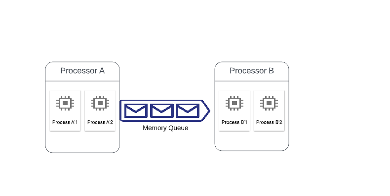
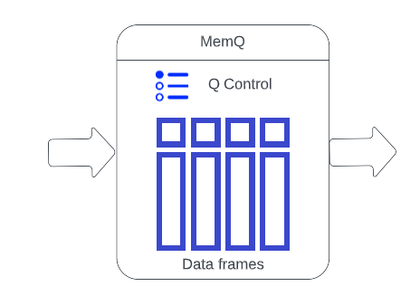
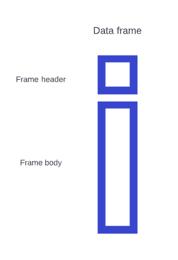

# uPipe basics #

uPipe abstract data pipeline into a simple model compute graph, in this model the processor are the edges in the processing graph where each connection is done using [queue](https://en.wikipedia.org/wiki/Queue_(abstract_data_type))  
A processor is an abstracted entity that can point to many processes, where each process is an exact copy of the processor code.



### Declaration and execution ###
uPipe has two phases:

* Declaration : The Processors and data flow are defined as pipe. 
* Execution: Pipe is sent to execution, Processes are spawn and data is processed. 

_pipe.start_ is starting the execution
```python
        ####Declaration     
        a = Processor('a', func=processor_a)
        b = Processor('b', func=processor_b)
        pipe = Pipe('plus-one')
        pipe.add(a).add(b)
        ####Declaration done

        await pipe.start() #all processes are spawn 
        
        ####Execution now takes place
        await pipe.wait_for_completion()
        ####Execution completed
        
```
### The memory queue ###
Python 3.8 introduced the shared memory under [_multiprocessing.shared_memory_](https://docs.python.org/3/library/multiprocessing.shared_memory.htmlf). While shared memory could be used before using mmap, making shared memory is first class citizen in python reduces complexity and improves ease of use.
The shared memory access across different OS processes is what allow us to deliver data very fast between those processes. The MemQ object uses shared memory to expose very fast inter-process queue. The Q accepts data frames where every process can push (enqueue) and pull (dequeue) data frames from the Q. Q management is done on the Q memory itself, is a designated shared area. 



### Data frame ###
Data frame is a binary array container, it can hold anything from simple number in the form of 8 bit unsigned int all the way to full HD image. 
Each dataframe carries 64 byte header, that encapsulate the data frame properties like data type, data size and CRC32 data integrity checks.
Upipe allows working directly with native data types, implicit encapsulating them into dataframes. more complex data types requires the construction and parsing of data frames by the Processor.

**Attention**

uPipe handles serialization of many data types automatically but defaults to pickle, pickle [is not secured](https://www.synopsys.com/blogs/software-security/python-pickling/) since it allows code execution injection inside the data.  
The above means you should be careful when consuming non-trusted data and consider:
* Incase you process user data, make sure to validate its legit before ingestion into pipe. 
* Implement custom data type supporting your data types.
* Block external data from unstructed sources 



### Muti-machine pipeline ###
While the current project focus is maximizing data throughput locally easily, it is clear there is a need to allow pipelines to execute over many servers for high workloads. uPipe architecture support future clustering thorugh memory reflection of the Queues where two synched copies of the Q memory are shared across machine, where the queue us defined as _remote_queue_ to the emitting processor. The initial support for remote queues is done using HTTP, where you can exepct future versions to support higher performant methods and hardware like [RDMA](https://en.wikipedia.org/wiki/Remote_direct_memory_access) which is gaining increasing attention.     

### Basic example - counter ###
Note :

* Emit can accept data type, yet it is not mandatory
* get_sync support timeout to avoid infinite loops and break locks 
* while the code seems to be the same python module, each inline processor will run in its own process. 


    import asyncio
    
    from upipe import Processor, Pipe, DType
    
    limit = 100000
    async def processor_a():
        global limit
        print("Hello embedded processor a")
        me = Processor("a")
        await me.connect()
        print("a connected")
        val = 1
        while True:
            if await me.emit(val, DType.U32):
                if val % 1000 == 0:
                    print(f"{val / 1000}K")
                if val == limit:
                    break
                val += 1
            else:
                print('failed')
        print("a done")
    
    
    async def processor_b():
        global limit
        print("Hello embedded processor b")
        proc = Processor("b")
        await proc.connect()
        while True:
            try:
                counter = await proc.get_sync()
                if counter == limit:
                    break
            except TimeoutError:
                print("timeout")
                break
            if counter % 1000 == 0:
                print(f"{counter / 1000}K")
        print("embedded processor b completed")
    
    
    async def main():
        a = Processor('a', func=processor_a)
        b = Processor('b', func=processor_b)
        pipe = Pipe('plus-one')
        pipe.add(a).add(b)
        await pipe.start()
        await pipe.wait_for_completion()
        print("Running")
    
    
    if __name__ == "__main__":
        loop = asyncio.get_event_loop()
        loop.run_until_complete(main())