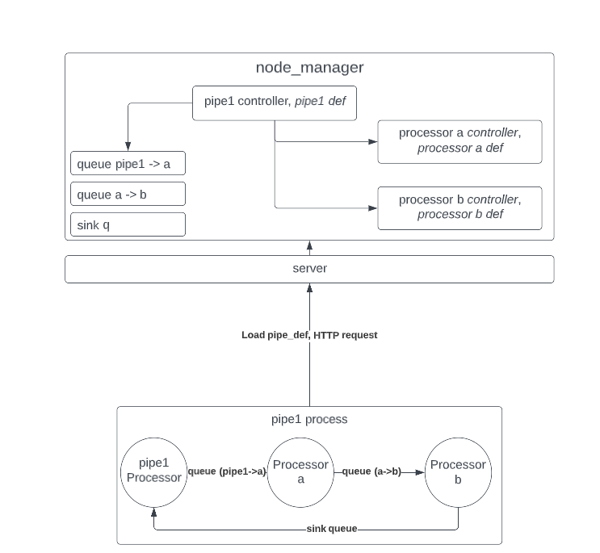
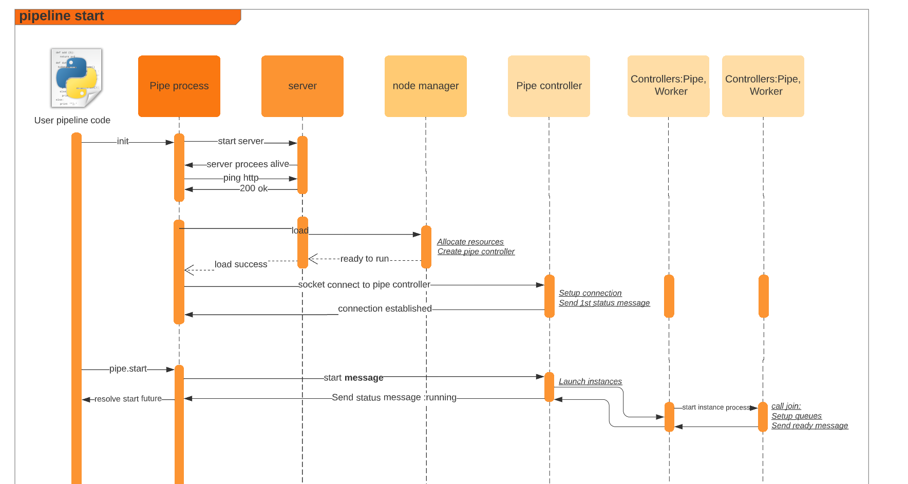

# uPipe Design #

Let us take a look on a simple pipeline code :

```python
        ####Declaration     
a = Processor('a', func=processor_a)
b = Processor('b', func=processor_b)
pipe1 = Pipe('pipe')
pipe1.add(a).add(b)
#### load & start
await pipe1.start()  ## now monitoring
#### wait for completion
await pipe1.wait_for_completion()
```

we will use this code as a guide for a design walk-through, tracking these phases:

* Declaration
* Loading
* Execution control
* Monitoring
* Completion

### Pipe Declaration

The pipeline declaration takes place in the pipeline process and essentially a simple tool to define the processing
tree. In this phase the pipeline topology is defined and once ready sent to the local server for loading. All uPipe
entities access the server in two ways:

* REST
* Websocket

The rest interface is used to load, start and set up the socket connections. once pipeline is running the wrokers will
communicate with server using the sockets, where main communication is performance metric reporting.

The server and the clients are exchanging uPipe entities definitions.

each uPipe API entity is essentially a python class that exposes its API definition
as [pydentic](https://pydantic-docs.helpmanual.io/) object, here is an example to the Processor API definition:

```python
class APIProcessor(UPipeEntity):
    type: UPipeEntityType = UPipeEntityType.PROCESSOR
    entry: Optional[str]
    function: Optional[str]
    interpreter: Optional[str]
    settings: APIProcSettings = APIProcSettings()
```

The Entity API definition is a way to pass the entity properties, commands and status from the pipe participating
process (pipe process, worker process) to the server and node manager.

The declaration takes place using chaining of _add_ commands of the _Processor_, As we already stated, The Pipe class is
a Processor(Inheritance) so one could imagine the basic pipe tree node as:

```python
class Processor:
    children: List[Processor] = []
```
Where the Pipe is the _root processor_

at any given point one can access the _pipe.pipe_def_ property, this property will map the pipe and return the pipeline definition: List of Processors and Queues. 

### Pipe control plane

Once pipeline is loaded the system will look as follows: 



We can observe the following:
* Queues are defined in the _pipe process_ but allocated during load on node manager. if pipe resources are not available _load_ will return an error. 
* every uPipe entity have a controller inside the node manager. 
* once loaded, every entity will establish socket connection with its controller
* The pipe implicitly defines the sink queue as part of its API definition
* controller is instantiated based on API definition

once _pipe.start_ is called, the following sequence takes place:

